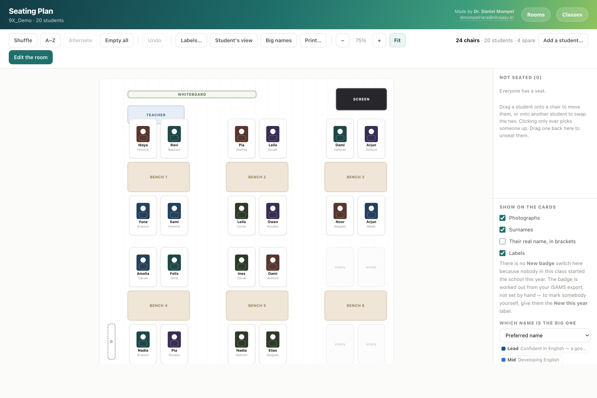

# Seating Plan

Drag photographs into chairs. Export three reports from iSAMS, drop them on the app, and you have a
seating plan for a new class in **under five minutes**.

> ## ⚠️ You need iSAMS
>
> This is built around exports from **iSAMS**, the school management system. **If your school does
> not use iSAMS, this will not work** — there is nowhere for it to get your class from.
>
> It takes up to **three reports**, all exported as Excel from Student Manager ▸ Selected Students ▸
> Exporting and Reports:
>
> | Report | What it gives the plan |
> |---|---|
> | **Export Wizard file** | names, **preferred names**, dates of birth, gender |
> | **Student ID Badge** | the **photographs** |
> | **Students Simple Report** | year group and form, and the enrolment year behind the **New this year** badge |
>
> The first two are enough to make a usable plan. The third fills in the rest. The photographs are
> the part nothing else can replace: only the iSAMS Student ID Badge report produces that file.
>
> If your school runs a different MIS it *may* still manage the names — the reader takes an
> Excel file and looks for `Surname` and `Forename` columns, accepting the usual variants
> (`Last Name`, `Given Name`, `Known As`, `Date of Birth`, `Form`, `Tutor Group`, `House`). That
> route is untested against anything but iSAMS, and it will not bring the photographs with it.
>
> Please check this before you spend time downloading it.

A seating plan is only useful if you can make one before the lesson and read it from the front of the
room. This is a small Mac app that does that and nothing else. It runs on your own machine, keeps
your classes in a folder you can see, and never sends a child's name or face anywhere.

*Every name and face above is invented — the screenshot was taken with a made-up class.*

## What it does

- **Loads your class from your iSAMS reports.** Drag them onto the page and it has every name and
  photograph. Nothing to type in.
- **Matches your actual room.** Put in the benches, tables, board, teacher's desk and door where
  they really are, and the chairs where the chairs really are.
- **Seats them by dragging.** Drop a student on a chair to move them, or on another student to swap
  the two. Buttons for a shuffle, for register order, and for moving people apart.
- **Marks who needs what** — support, a seat at the front, two people who should not sit together.
  It shows as a colour you can read at a glance, not as words a student could read over your
  shoulder.
- **Holds more than one plan per class,** so the layout you use for a practical is not the one you
  use for a test. Switch between them in a click.
- **Prints for your folder,** or goes on the board the right way round, so the class can find their
  own seats as they come in.

## What each card shows

The photograph, the name you call them, and the surname. You can also show their legal name in
brackets, and your own labels. A **New this year** badge is worked out from the iSAMS export
rather than set by hand, so it stays right on its own.

## Privacy

This matters more than the features, so it is worth being plain about it.

- **Everything stays on your Mac.** The app is a small local web server that only ever listens on
  `127.0.0.1`, for your browser, on a random port, behind a token generated at launch. There is no
  account, no cloud, no telemetry, and no outbound request of any kind.
- **Your classes are a folder you can open.** `Classes/<class>/students.csv` and a `photos/` folder
  beside it. You can read them, back them up, or delete them in the Finder. Nothing is hidden in a
  database.
- **Photographs of children are the most sensitive thing here.** Treat the folder the way you would
  treat a printed class list with photographs on it: keep it on a machine only you use, and delete a
  class when you no longer teach it. The app will not stop you copying the folder somewhere
  careless; nothing can.
- **This repository contains no pupil data.** The screenshot above is an invented class, and the
  `Classes/` folder is ignored by git so a real one can never be committed by accident.

## Installing

Download the repository (**Code ▸ Download ZIP**), keep the folder together wherever you like —
Documents is fine — and double-click `Install.command`.

macOS will block it the first time, because the app is not signed by a paid Apple developer account.
That is expected. `READ ME FIRST.html` walks through the three clicks that get past it
( ▸ System Settings ▸ Privacy & Security ▸ **Open Anyway**). You do it once.

You get one Desktop icon, **Seating Plan**, which opens in its own window rather than a browser tab.

If you move the folder afterwards, run `Install.command` again — the icon points at wherever the
folder was when you installed.

`Uninstall.command` removes the Desktop icon and the background pieces. Your classes stay; delete
the folder yourself if you want them gone.

## Requirements

- **iSAMS**, and the reports listed at the top. All of them come from Student Manager ▸ tick the
  class ▸ Search ▸ select all ▸ Selected Students ▸ Exporting and Reports. Choose **Excel** every
  time iSAMS offers you a format.
- **macOS.** Built from Swift for the window and Python for the local server, both of which macOS
  already has — nothing to install first, and no dependencies to keep up to date.

## Made by

Dr Daniel Mompel Riera, Biology, NLCS Jeju — <dmompelriera@nlcsjeju.kr>

Free for any school to use, change, and pass on.

## Licence

[**AGPL-3.0**](LICENSE). Use it, change it, run it — free, and you never need to ask. If you change it
and let anyone else use it, *including over a network*, you have to publish your source under the same
licence.

**Not covered:** third-party images and media keep their own licences — see the picture credits.

© 2026 Dr Daniel Mompel Riera. I hold the copyright, so I can grant other terms: if you want to use any of
this commercially, ask me at <dmompelriera@nlcsjeju.kr>.
